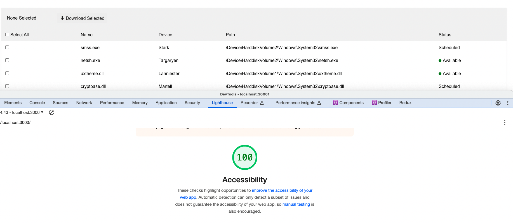

# Getting Started with Create React App

This project was bootstrapped with [Create React App](https://github.com/facebook/create-react-app).

## Available Scripts

Steps to run :

# npm i

# npm start

Runs the app in the development mode.\
Open [http://localhost:3000](http://localhost:3000) to view it in your browser.

Covered below points :

1. Only those that have a status of "available" are currently able to be downloaded. Your implementation should manage this.
  ( As per the above statement , When user clicks on download button only rows those are having status as available will be downloaded .
  However , user can select any row ( We can disable also but depends on behaviour what we want to give to user))
2. The select-all checkbox should be in an unselected state if no items are selected.
3. The select-all checkbox should be in a selected state if all items are selected.
4. The select-all checkbox should be in an indeterminate state if some but not all items are selected.
5. The "Selected 2" text should reflect the count of selected items and display "None Selected" when there are none selected.
6. Clicking the select-all checkbox should select all items if none or some are selected.
7. Clicking the select-all checkbox should de-select all items if all are currently selected.
8. Status should be correctly formatted
9. Clicking "Download Selected" when some or all items are displayed should generate an alert box with the path and device of all selected files.# Precise/exact HTML formatting/styling to match the mockup is not required however rows should change colour when selected and on hover.

Completely Accessible Table as per Lighthouse score

